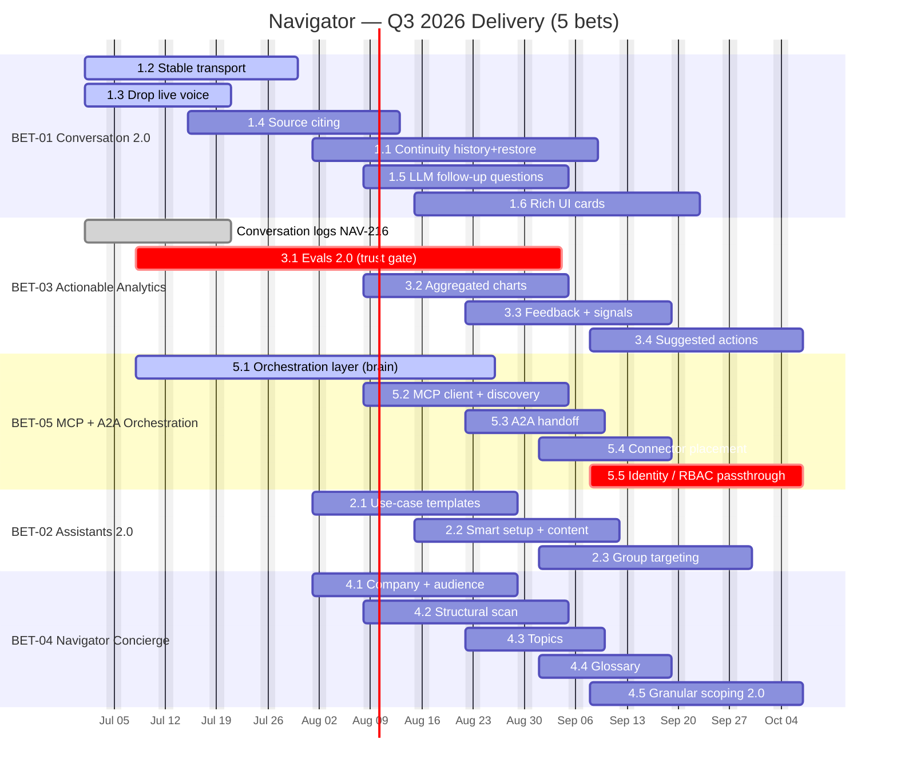
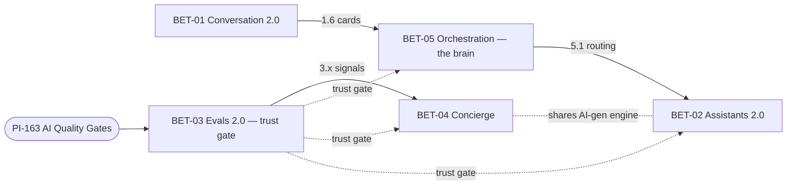

# Navigator — Q3 2026 Delivery Timeline

**Horizon:** July–September 2026 · **Scope:** the 5 product bets (01, 03, 05, 02, 04), epic-level deliverables · **Author:** Zee · **Status:** proposed sequencing for review

> **This is a constructed plan, not a Jira readout.** Navigator epics carry no due dates in Jira today (only NAV-216 had one, already past). The sequencing below is derived from each initiative's documented MVP scope and dependency graph. Dates are planning targets to be confirmed in sprint planning.
>
> **Out of scope for this view:** BET-00 Tech Enablement (cross-cutting enabler) and BET-06 Staffbase MCP / BET-07 Search ⇄ Navigator (both externally gated by partner teams).

---

## The shape of the quarter

The quarter has one spine. Two things land first because everything else leans on them:

1. **BET-01 Conversation 2.0** — the experience foundation. Its rich-card envelope (1.6) is what renders BET-05 tool results in chat.
2. **BET-03 Evals 2.0 (3.1)** — the **trust gate**. Until quality measurement is accurate, we can't confidently ship anything in the other bets.

Then **BET-05 orchestration ("the brain")** matures — BET-02 routing depends on it. **BET-02 and BET-04** run in parallel on the shared AI-generation engine.

---

## Per-bet deliverables (Q3)

| Bet | Owner | Status | July | August | September |
|---|---|---|---|---|---|
| **BET-01** Conversation 2.0 (PI-152) | Khaled | In Progress | 1.2 Stable transport · 1.3 Drop live voice · 1.4 Source citing | 1.1 Continuity · 1.5 Follow-up Qs · 1.6 Rich UI | 1.6 Rich UI cont. |
| **BET-03** Actionable Analytics (PI-305) | Zee | Open | Conversation logs (NAV-216) · 3.1 Evals 2.0 ★ | 3.1 Evals 2.0 · 3.2 Charts | 3.3 Feedback signals · 3.4 Suggested actions |
| **BET-05** MCP + A2A Orchestration (PI-307) | Khaled | In Progress | 5.1 Orchestration layer | 5.1 cont. · 5.2 MCP client · 5.3 A2A handoff | 5.4 Placement · 5.5 Identity/RBAC ★ |
| **BET-02** Assistants 2.0 (PI-304) | Zee | Open | — | 2.1 Templates · 2.2 Smart setup | 2.3 Group targeting |
| **BET-04** Navigator Concierge (PI-306) | Filip | Discovery | — | 4.1 Company/audience · 4.2 Structural scan · 4.3 Topics | 4.4 Glossary · 4.5 Granular scoping 2.0 |

★ = trust / prod gate

**Out of Q3:** BET-02 §2.4 per-Expert tool hooks lands Q4 (blocked by BET-05 §5.2).

---

## Dependencies & gate

- **BET-01 → BET-05:** the 1.6 rich-card envelope renders BET-05 tool results in chat.
- **BET-05 → BET-02:** multi-Expert routing depends on the 5.1 orchestration layer.
- **BET-02 ⇄ BET-04:** share the AI-generation engine (2.2 ↔ 4.x).
- **BET-03 → BET-04:** 3.x signals feed Concierge config in later iterations.
- **BET-03.1 Evals 2.0** is the **trust gate** for confidently shipping BET-02/04/05; cross-cuts **[PI-163](https://mitarbeiterapp.atlassian.net/browse/PI-163)** (AI Quality Gates, Martin).

## Open questions to resolve before Q3 locks

- **BET-02:** Is IDAM / user-group access ready in time for 2.3 group targeting?
- **BET-04:** Advisory-first MVP confirmed (recommend → admin approves)? Nothing high-risk auto-applies.
- **BET-05:** OAuth fallback for connectors without per-user delegation — service-account fallback yes/no?

---

## Miro import — paste these into a Miro board

Miro renders Mermaid via **Apps → Mermaid / Diagram-as-code → paste**. Two views below: a Gantt for the timeline, and a dependency graph for the spine.

### View 1 — Gantt (timeline)

### View 2 — Dependency spine

*Generated for the Q3 2026 planning cycle. Source: PI initiatives PI-152, PI-304, PI-305, PI-306, PI-307 on mitarbeiterapp.atlassian.net.*
