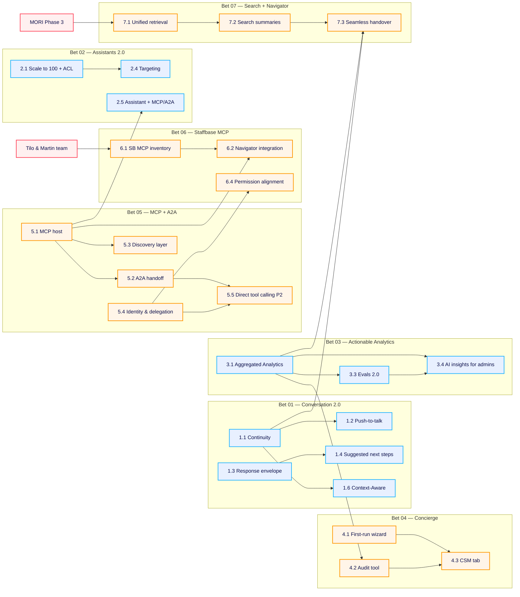

# Navigator 2026 — Bets Discovery Plan

> **Owner:** Zee Abuzeid · **Initiative:** [PI-152](https://mitarbeiterapp.atlassian.net/browse/PI-152) · **Date:** 2026-05-21 · **Status:** Working doc for team call today (post-Martin approval)
> **Audience:** Navigator team — Engineering, Design, PM, Data
> **Layer:** 2 — Execution. Layer 1 (Strategy) is [2026 Roadmap Q2 and beyond](https://mitarbeiterapp.atlassian.net/wiki/spaces/AW/pages/6918012931/2026+Roadmap+Q2+and+beyond), approved by Martin today.

## Context

Martin signed off the 4 → 7 bet reshape this morning. This page is the bridge from strategy to discovery. It assigns one owner per topic so discovery can start tomorrow, not next week.

**The seven bets (recap):**
- **Sharpened** (existing roadmap, clearer outcomes): `01 Conversation 2.0` · `02 Assistants 2.0` · `03 Actionable Analytics`
- **NEW** (strategic adds): `04 Navigator Concierge` · `05 MCP + A2A Orchestration` · `06 Staffbase MCP` · `07 Search ⇄ Navigator`

**Killed today** (not deferred — gone): live voice experience, mem0 user memory.

**The prototype at `zee-playground.vercel.app` is the opinionated reference.** See [Navigator 2.0 Hackathon results](https://mitarbeiterapp.atlassian.net/wiki/spaces/AW/pages/6932168734/Navigator+2.0+Hackathon+results). Anything in the "Locked decisions" section below is settled — discovery does not re-litigate it.

---

## How this works

- Each bet has one **Bet Owner** who runs discovery for the whole bet.
- Sub-topics get their own owners — usually Eng + Designer, sometimes Data or PM partner.
- Owners are **TBD with a role hint**. Names get assigned in today's call.
- Every sub-topic ends with a PRD. **PRD ↔ Jira Epic 1:1** (three-layer tracking rule).
- Dependencies are surfaced explicitly. External blockers (MORI, Tilo's team) are called out at the bottom.
- Status legend: `✓ PRD exists` · `△ PRD partial / sub-PRD needed` · `⨯ PRD GAP — must be written`

---

## Locked decisions (set by the prototype — do not re-open)

These came out of the hackathon. They are the substrate everyone builds on. If you disagree, raise it in a separate thread, not in discovery for these bets.

1. **Five-module boundary**: `lib/discovery/` · `lib/orchestrator/` · `lib/flows/` · `lib/mcp/` · `src/ui/`. Each has a typed in/out contract.
2. **Three port contracts**: `SourceAdapter`, `ToolProvider`, `FlowProvider`. To port Navigator anywhere, implement these three.
3. **Versioned prompt files** with mustache placeholders. Edits take effect on next request, no rebuild.
4. **Two-tier intent routing**: deterministic flow-trigger match → LLM classifier only if no flow matches.
5. **Deterministic flow runtime**: state machines (Form / Tool / Confirm steps). No LLM at flow runtime; LLM only at authoring time.
6. **Canonical `ToolResult` envelope**: `{summary, data, presentation?, sources?}`. LLM reads `summary` + `data`; UI reads `presentation`; no contention.
7. **Staffbase is just-another-MCP**. Native feel comes from a `staffbaseEnrichment` middleware on the chain, not a special branch.
8. **Presentation registry**: `presentation.kind` → React component. 14 kinds today, JSON fallback for unknowns. New cards = one-component PR.
9. **Chat adapter as the seam**: orchestrator emits NDJSON events; `chat-adapter.js` produces typed `RenderItem`s. UI never reads orchestrator internals.
10. **One DB, one LLM provider, no new infra**: Neon Postgres (5 tables), OpenAI (model named at every call site), Vercel + Vite.

---

## The 7 bets — sub-topics, owners, PRD status, dependencies

### Bet 01 — Conversation 2.0  `SHARPENED`

**Bet Owner:** TBD (PM partner — Conversation Layer)
**Existing PRDs:** [Navigator 2.0 Umbrella](https://mitarbeiterapp.atlassian.net/wiki/spaces/AW/pages/6916735022) · [Conversation Continuity](https://mitarbeiterapp.atlassian.net/wiki/spaces/AW/pages/6861750311) · [Context-Aware Navigator](https://mitarbeiterapp.atlassian.net/wiki/spaces/AW/pages/6862340141) · [Mobile/Desktop UX](https://mitarbeiterapp.atlassian.net/wiki/spaces/AW/pages/6807715856) · [2.0 Architecture Proposal](https://mitarbeiterapp.atlassian.net/wiki/spaces/AW/pages/6907166752)

| # | Sub-topic | Status | Owner (role hint) | Depends on |
|---|-----------|--------|-------------------|-----------|
| 1.1 | Conversation continuity, history, session management | ✓ | TBD — Eng (Conversation Layer) | — (foundation) |
| 1.2 | Push-to-talk transport (VoiceLive retirement) | ⨯ | TBD — Eng (Voice / Transport) | 1.1 session model |
| 1.3 | Response envelope (sources inline, structured) | △ | TBD — Eng (Conversation) + Designer | ToolResult envelope (locked) |
| 1.4 | Model-suggested next steps (clarification · next_action · related) | △ | TBD — Eng (Orchestrator) + Designer | 1.3 |
| 1.5 | Per-message language detection + override | △ | TBD — Eng (Conversation) | — |
| 1.6 | Context-Aware Navigator (page intelligence) | ✓ | TBD — Eng (Conversation) + Designer | 1.1 live |

---

### Bet 02 — Assistants 2.0  `SHARPENED`

**Bet Owner:** TBD (PM partner — Admin / Studio)
**Existing PRDs:** [Scale to 100 Assistants + ACL](https://mitarbeiterapp.atlassian.net/wiki/spaces/AW/pages/6862929948) · [Navigator Assistants (Multi-Agent)](https://mitarbeiterapp.atlassian.net/wiki/spaces/AW/pages/6807814148)

| # | Sub-topic | Status | Owner (role hint) | Depends on |
|---|-----------|--------|-------------------|-----------|
| 2.1 | Scale to 100 assistants + user/group ACL | ✓ | TBD — Eng (Orchestrator) | — |
| 2.2 | AI generation of assistants (prototype has `AssistantAiCreator`) | ⨯ | TBD — Eng + Designer | Concierge discovery wizard (shared infra) |
| 2.3 | Assistant templates marketplace (prototype has `TemplatesGallery`) | ⨯ | TBD — PM + Designer | — |
| 2.4 | Targeting (user group × content × behavior) | ⨯ | TBD — Eng (Orchestrator) | 2.1 ACL |
| 2.5 | Assistant ↔ MCP/A2A integration | ⨯ | TBD — Eng (Orchestrator) | Bet 05 MCP host live |

---

### Bet 03 — Actionable Analytics  `SHARPENED`

**Bet Owner:** TBD (PM partner + Data lead)
**Existing PRDs:** [Aggregated Analytics & Conversation Intelligence](https://mitarbeiterapp.atlassian.net/wiki/spaces/AW/pages/6808338450) · [Analytics Dashboard Build Spec](https://mitarbeiterapp.atlassian.net/wiki/spaces/AW/pages/6833405959) · [Conversation Logging Requirements](https://mitarbeiterapp.atlassian.net/wiki/spaces/AW/pages/6355910674)

| # | Sub-topic | Status | Owner (role hint) | Depends on |
|---|-----------|--------|-------------------|-----------|
| 3.1 | Aggregated Analytics + resolution state per conversation | ✓ | TBD — Eng (Analytics) + Data | — |
| 3.2 | Employee feedback (answer rating + conversation rating) | ⨯ | TBD — Eng + Designer | — |
| 3.3 | **Evals 2.0 — robust evaluation framework** (named in Hackathon as out of scope, now in) | ⨯ | TBD — Eng + Data + PM | 3.1 (needs ground-truth source) |
| 3.4 | AI insights for admins (suggested actions, suggested assistants, content gaps) | ⨯ | TBD — Eng (Analytics) + Designer | 3.1 live + 3.3 |

---

### Bet 04 — Navigator Concierge  `NEW`

**Bet Owner:** TBD (PM lead — needs strong GTM literacy)
**Existing PRDs:** [Activation Concierge](https://mitarbeiterapp.atlassian.net/wiki/spaces/AW/pages/6916866086) (high-level) · [Hackathon results](https://mitarbeiterapp.atlassian.net/wiki/spaces/AW/pages/6932168734) (working prototype)

| # | Sub-topic | Status | Owner (role hint) | Depends on |
|---|-----------|--------|-------------------|-----------|
| 4.1 | First-run wizard (Studio onboarding) | △ | TBD — Eng (Discovery) + Designer | Discovery module (locked) |
| 4.2 | Audit / refresh tool (re-onboarding for live tenants) | ⨯ | TBD — Eng + PM | Bet 03 Aggregated Analytics |
| 4.3 | CSM-facing tab in Studio (open Q: advisory vs autonomous) | ⨯ | TBD — PM + Designer + GTM partner | 4.1 + 4.2 live |
| 4.4 | Discovery wizard productization (Pass A + Pass B + optimize) | ⨯ | TBD — Eng (Discovery) + Designer | — |

---

### Bet 05 — MCP + A2A Orchestration  `NEW`

**Bet Owner:** TBD (PM partner — platform / integration affinity)
**Existing PRDs:** [Agent Network — Open Agent Integration via MCP](https://mitarbeiterapp.atlassian.net/wiki/spaces/AW/pages/6791364650) · [MCP Platform (Atlassian Wave)](https://mitarbeiterapp.atlassian.net/wiki/spaces/AW/pages/6899990542) · [MCP Identity & Delegation](https://mitarbeiterapp.atlassian.net/wiki/spaces/AW/pages/6917750801) · [Action Integrations Framework ⚠ at risk](https://mitarbeiterapp.atlassian.net/wiki/spaces/AW/pages/6807584770) · [Truto × Navigator](https://mitarbeiterapp.atlassian.net/wiki/spaces/AW/pages/6797525151) · [ServiceNow](https://mitarbeiterapp.atlassian.net/wiki/spaces/AW/pages/6808633347) · [Event-Driven Actions](https://mitarbeiterapp.atlassian.net/wiki/spaces/AW/pages/6807945226)

| # | Sub-topic | Status | Owner (role hint) | Depends on |
|---|-----------|--------|-------------------|-----------|
| 5.1 | MCP host capability (Atlassian Wave proof point) | ✓ | TBD — Eng (Orchestrator) | — |
| 5.2 | A2A handoff protocol | △ | TBD — Eng (Orchestrator) | 5.1 |
| 5.3 | Discovery layer (tools / resources / prompts / skill cards) | ⨯ | TBD — Eng (Orchestrator) + Designer | 5.1 |
| 5.4 | Identity & delegation (OAuth user-token passthrough) | ✓ | TBD — Eng (Identity / Security) + Security partner | — (blocking for prod rollout) |
| 5.5 | Direct tool calling Phase 2 (inline, multi-step) | ✓ | TBD — Eng (Orchestrator) | 5.2 + 5.4 |
| 5.6 | External Knowledge Connectors — SharePoint Phase 1 | ✓ | TBD — Eng (Orchestrator) + Search liaison | 5.1 |

---

### Bet 06 — Staffbase MCP  `NEW`

**Bet Owner:** TBD (PM partner — close to Tilo & Martin's team)
**Existing PRDs:** ⨯ **NONE — biggest gap on the page.** Strategy is in slide deck + Hackathon middleware pattern; no product spec exists.

| # | Sub-topic | Status | Owner (role hint) | Depends on |
|---|-----------|--------|-------------------|-----------|
| 6.1 | Staffbase MCP server inventory (what Tilo / Martin already exposed) | ⨯ | TBD — PM + Eng liaison to Tilo's team | Alignment with Tilo's team (external) |
| 6.2 | Navigator ↔ Staffbase MCP integration (using prototype middleware pattern) | ⨯ | TBD — Eng (Orchestrator / MCP) | 6.1 + 5.1 MCP host |
| 6.3 | Rich card presentations for Staffbase entities (posts, channels, people) | ⨯ | TBD — Eng (UI) + Designer | Presentation registry (locked) |
| 6.4 | Permission model alignment (Staffbase RBAC ↔ Navigator user tokens) | ⨯ | TBD — Eng (Identity) + Security partner | 5.4 Identity & delegation |

---

### Bet 07 — Search ⇄ Navigator  `NEW`

**Bet Owner:** TBD (PM partner — co-owned with Search team PM)
**Existing PRDs:** [Search Infrastructure Strategic Proposal](https://mitarbeiterapp.atlassian.net/wiki/spaces/AW/pages/6721339395) · [Search Granular Controls V1](https://mitarbeiterapp.atlassian.net/wiki/spaces/AW/pages/6807912455) · [SharePoint Connector](https://mitarbeiterapp.atlassian.net/wiki/spaces/AW/pages/6814236688) · [Rettungsplan / Azure-backed retrieval](https://mitarbeiterapp.atlassian.net/wiki/spaces/AW/pages/6664749061)

| # | Sub-topic | Status | Owner (role hint) | Depends on |
|---|-----------|--------|-------------------|-----------|
| 7.1 | Unified retrieval (one engine, MORI hybrid search) | ⨯ | TBD — Eng (Search liaison) + Search PM co-owner | MORI Phase 3 commitment (external) |
| 7.2 | Search summaries (AI answer above search results) | ⨯ | TBD — Eng + Designer + Search team | 7.1 |
| 7.3 | Seamless handover (search → conversation UX) | ⨯ | TBD — Designer + Eng (UI) + Search team | 7.2 + Bet 01 continuity |
| 7.4 | Source quality + freshness signals (admin-side) | ⨯ | TBD — PM + Eng (Analytics) | Bet 03 Aggregated Analytics |

---

## Two kills — owner + decommission plan

| Item | Owner | Plan |
|------|-------|------|
| Live voice experience (VoiceLive retirement) | TBD — Eng (Voice / Transport) — same as `1.2` push-to-talk owner | Push-to-talk lands as replacement → live voice deprecated → API decommission. Side effect: fixes mobile source-click bug. |
| mem0 user memory | TBD — Eng (Orchestrator) | Remove from runtime. Fall back to assistant-level context + Bet 01 continuity for the user-level signal we actually need. |

---

## Dependency map

---

## Critical path (the 5 chains that gate everything else)

1. `1.1 Continuity` → `1.3 Response envelope` → `1.4 Suggested next steps` → `1.6 Context-Aware` → `7.3 Seamless handover`
2. `5.1 MCP host` → `5.2 A2A handoff` + `5.4 Identity` → `5.5 Direct tool calling P2` → `2.5 Assistant + MCP/A2A` → `6.2 Navigator + Staffbase MCP`
3. `5.4 Identity` → `6.4 Staffbase RBAC alignment` (security-blocker for Bet 06 rollout)
4. **External**: Tilo / Martin team → `6.1 SB MCP inventory` → everything in Bet 06
5. **External**: MORI Phase 3 → `7.1 Unified retrieval` → `7.2 Search summaries` → `7.3 Handover`

---

## PRD gaps to fill this sprint (priority order)

| # | Gap | Why now | Owner (role hint) |
|---|-----|---------|-------------------|
| 1 | **Staffbase MCP — whole-bet PRD** | Bet 06 has no spec at all. Biggest single risk. | TBD — Bet 06 owner |
| 2 | **Search ⇄ Navigator product PRD** | Strategy doc exists, no product PRD. Largest MAU lever. | TBD — Bet 07 owner + Search PM |
| 3 | **Push-to-talk / voice transport** | Two kills (live voice) + Bet 01 unlock both ride on this. | TBD — `1.2` owner |
| 4 | **Evals 2.0** | Called out in Hackathon as out-of-scope. Now in scope. Trust gate for everything. | TBD — `3.3` owner |
| 5 | **Conversation 2.0 sub-PRDs** (response envelope, suggested next steps, language detection) | Today they live inside the 2.0 Umbrella; engineering needs each as its own discoverable spec. | TBD — Bet 01 owner |
| 6 | **AI insights for admins** | Currently inside Aggregated Analytics; deserves its own PRD because it drives Bet 04 audit/refresh. | TBD — `3.4` owner |
| 7 | **Concierge sub-PRDs** (wizard UX, audit tool, CSM tab) | High-level PRD exists; sub-PRDs needed for Eng to scope. | TBD — Bet 04 owner |
| 8 | **Assistants 2.0** (AI generation, templates, targeting) | Prototype has all three; production specs missing. | TBD — Bet 02 owner |

---

## Restructuring opportunities

These are clean-up items for the [PRD Master Index](https://mitarbeiterapp.atlassian.net/wiki/spaces/AW/pages/6808174603) — do them in week 1, not in the call.

1. **Master Index page** — currently shows the old structure. Re-organise around the 7 bets and link sub-PRDs underneath.
2. **Multi-Agent + Scale to 100 PRDs** — both are Bet 02 today. Merge or supersede one with a clear note.
3. **Action Integrations Framework + Agent Network + MCP Platform** — three overlapping PRDs in Bet 05. Consolidate into one parent PRD + scoped sub-PRDs (Identity, Discovery, A2A, Direct tool calling, External KB connectors).
4. **Hackathon page** — link it from every bet page that consumes its decisions, so future PMs find the "why" trail.
5. **Voices Feedback Triage / Rollout Process / GA Readiness** — archive or move to an Ops sub-space. They are operational, not product strategy.

---

## Today's call — agenda (60 minutes)

| Time | Topic | Who drives |
|------|-------|-----------|
| 0–5 | Bet shape recap. 4 → 7. What's new vs sharpened. Two kills. | Zee |
| 5–15 | **Locked decisions from prototype** — read the list together. No re-litigation. | Zee + Eng leads |
| 15–45 | **Walk the 7 bets**. Assign Bet Owner + sub-topic owners live. ~4 min per bet. | Zee, everyone calls out |
| 45–55 | Cross-cutting deps + external blockers. Confirm liaisons for Tilo's team and Search team. | Zee + named liaisons |
| 55–60 | Close the loop. Top-8 PRD gaps — who picks up what this sprint. | Zee |

**Out of scope for today's call:** detailed sequencing within bets, hiring against the 3 capability gaps, sprint planning. Those are follow-ups owned by the assigned Bet Owners.

---

## Open questions for the room

1. **Bet 04 CSM tab**: advisory (recommendations only, one-click apply) or autonomous (changes apply, admin reviews after)? Recommended starting point is advisory.
2. **Bet 05 OAuth fallback**: for agents that do not support per-user delegation — service-account fallback yes / no? Admin policy switch to disable?
3. **Bet 06 ownership boundary**: where does Tilo & Martin's MCP server work end and where does Bet 06 begin? Needs a clear interface line.
4. **Bet 07 joint ownership**: who is the Search team PM co-owner, and what is the cadence?
5. **Capability gaps (3)**: which of the 7 bets feel under-resourced today, and which gap is most urgent to close?

---

## Appendix — Prototype module inventory (for orientation)

What is already built in `zee-playground` that maps to which bet. Use this so owners can pull from the prototype rather than rebuild from scratch.

| Prototype area | Maps to | What's there |
|----------------|---------|--------------|
| `src/prototypes/Navigator/` (Studio) | Bets 02, 03, 04, 05 | Assistants list + AI creator + templates gallery, connectors list + add modal, flows, audit log, health, home, workspace, system prompt editor |
| `src/prototypes/NavigatorSetup/` | Bet 04 | Discovery wizard standalone view |
| `src/prototypes/StaffbaseCompanion/` | Bets 01, 05, 06 | Chat panel + tool-call cards + flow cards + intent trace + voice composer (push-to-talk) + slash menu + SSO picker + scenarios |
| `src/prototypes/AIAssistant/` (shared admin layer) | Bets 02, 05, 03 | Assistants, capabilities, deployment, identity, integrations, knowledge, platform connections hub, external agent creation, AI generation wizard |
| `lib/mcp-servers/` | Bets 05, 06 | atlassian, hr, intranet, it, kb, voices (7 mock MCPs to test against) |
| `lib/orchestrator/`, `lib/flows/`, `lib/discovery/`, `lib/mcp/` | Cross-cutting | Locked-decision modules. Engineering reads these to understand the production target shape. |

---

_Owner: Zee. This page is Layer 2 — Execution. Layer 1 is the [2026 Roadmap](https://mitarbeiterapp.atlassian.net/wiki/spaces/AW/pages/6918012931). Layer 3 is the monthly "Navigator Progress" post on Campsite._
